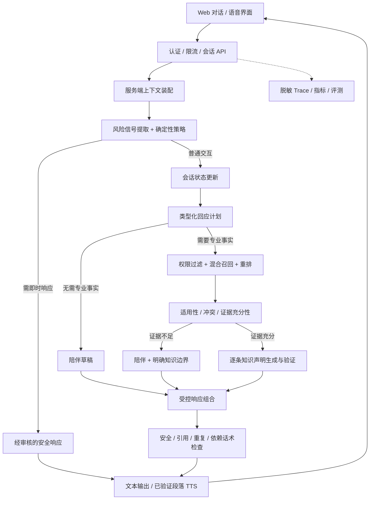

# 宝妈助手目标技术架构 v4

> 设计日期：2026-09-16。状态：待实施的目标架构，不是已部署能力清单。
> 本文描述接口、状态与模块目标；最新现状对照、官方资料核查、先进性标准和实施里程碑见 [v5 现状对照与前沿迭代方案](./现状对照与前沿迭代方案-v5.md)。

## 1. 产品契约

**一个连续的宝妈陪伴体验，两种不同的内容授权。**

- 情绪陪伴：允许倾听、自然回应、澄清需要和非医疗的现实支持，不要求先命中情绪关键词。
- 母婴知识：专业事实必须来自已审核、适用且有效的知识库，不用模型记忆补齐缺失内容。
- 医疗及心理边界：不诊断、不处方、不计算药物剂量、不承诺疗效，也不冒充有资质的专业人员。
- 普通缺证据不是“拒绝用户”：仍可承接感受，但明确专业部分暂不能回答。
- 急症、自伤/他伤、儿童安全等即时风险优先响应，不等待普通知识检索或人工工单。
- 不以延长对话、制造依赖或提升深夜使用时长作为陪伴优化目标。

“好的”“我能休息吗”是会话动作，不需要通过情绪关键词白名单获得回应资格。提到“宝宝”也不等于提出医疗问题。

## 2. 核心架构决策

| 领域 | 决策 | 理由 |
|---|---|---|
| 应用后端 | FastAPI + Pydantic + 异步模型客户端 | 请求、状态、计划和输出使用可校验契约 |
| 编排 | 单个受控 Harness，先用显式 Python 工作流 | 不引入自由规划、多 Agent 辩论或无限重试 |
| 会话状态 | PostgreSQL 保存会话和结构化短期状态 | 不能把前端传入的 route 当可信安全状态 |
| 检索存储 | PostgreSQL + pgvector | 文档权限、版本和向量统一管理，减少运维组件 |
| 关键词召回 | 中文分词 + BM25，初期应用内索引 | PostgreSQL 默认全文检索不是 BM25，默认分词也不足以处理中文 |
| 模型 | LLM、Embedding、可选 Reranker 独立 API 适配 | 不绑定厂商，分别设置模型版本、超时和错误策略 |
| 知识生成 | 受限结构化声明，逐条绑定证据 | 不把最终自由润色作为事实安全边界 |
| 语音 | 初期保留浏览器 API；后续 ASR/TTS 适配器 | 避免一次性引入实时音视频基础设施 |
| 可观测性 | OpenTelemetry；可选 Langfuse | 能解释走了哪条路径、是否降级、使用哪个模型 |
| 评测 | pytest + 专属对话金标集 + 可选 DeepEval/Ragas | 先验证产品行为，再优化模型分数 |

LangGraph 仅在确实需要持久检查点、暂停恢复、复杂人工审核时引入。PydanticAI 可以替代自建的类型化模型调用层，不与多个同类 Agent 框架重复堆叠。框架本身不提供临床安全保证。

## 3. 系统视图



逻辑节点不是必须部署为独立微服务。首期使用一个模块化后端、一个摄入 worker 和一个 PostgreSQL 实例。

## 4. 会话状态：解决连续陪伴

### 4.1 三类信息严格分离

1. **用户确认事实**：用户明确提供的宝宝年龄、照护情况；带来源消息 ID，不自行推断。
2. **模型暂时解释**：情绪、需求、可能话题；属于假设，不是心理诊断，不直接展示为事实。
3. **安全策略状态**：风险依据、时间、是否仍待澄清、已经显示过的资源；由服务端管理。

```json
{
  "conversation_id": "conv_123",
  "revision": 12,
  "topic_hypothesis": "照护中难以休息",
  "need_hypothesis": "validation",
  "emotion_hypothesis": "疲惫",
  "hypothesis_source_message_ids": ["msg_21"],
  "open_question": null,
  "recent_strategies": ["reflect", "gentle_question"],
  "recent_suggestions": ["询问是否有可信任的人可以接手"],
  "user_confirmed_facts": [],
  "risk_status": "no_signal",
  "risk_evidence_message_ids": [],
  "memory_consent": false
}
```

不使用未经校准的 `emotion_intensity=0.7` 充当真实心理测量。信息缺失时保留 unknown，而不是自动填满用户画像。

### 4.2 上下文策略

- 客户端只传会话 ID、消息 ID、文本；历史和状态由服务端装配。
- 使用最近若干轮原文 + 带来源的简短摘要 + 尚未解决的风险上下文，按 token 预算裁剪。
- 摘要不得自行添加医学结论；用户纠正的信息优先于旧摘要。
- 同一会话请求串行处理，revision 检测冲突，request_id 防重复提交。
- 切换话题允许自然发生，不用“最近出现过情绪”永久锁住通道。
- 普通的“好的”按确认、接受、结束等会话动作处理，不重复长篇安慰。
- 长期记忆单独 opt-in，可查看、编辑、删除；MVP 不默认建立跨会话健康画像。

## 5. 回应计划与生成

### 5.1 计划不是自由思维链

模型输出可审计的决策字段，不存储或向用户暴露隐藏推理过程。

```json
{
  "dialogue_act": "ask_permission",
  "need": "validation",
  "strategy": "brief_acknowledgement",
  "needs_knowledge": false,
  "knowledge_query": null,
  "clarification": null,
  "question_budget": 0,
  "length": "short"
}
```

计划使用枚举、长度和额外字段禁止规则校验。模型生成的 `knowledge_query` 必须保持原问题含义，不得添加疾病、年龄或用户未提供的条件。策略引擎决定实际工具权限，模型计划只能提出请求。

### 5.2 陪伴生成原则

- 回应当前具体表达，不自动推断“你很爱孩子”“你已经做得很好”。
- 不固定“听起来……如果愿意……”结构；短确认允许仅一句话。
- 用户拒绝建议时不换句话重复建议，优先倾听或接受停顿。
- 用户没有表达焦虑时不强加焦虑；知识查询不必每次先安慰。
- 只确认情绪，不确认危险信念、妄想内容或伤害行为合理性。
- 不建议照护者在仍独自负责婴儿安全时“人在心不在”、忽略哭声或闭眼睡觉；需要休息时讨论现实交接，不凭空假定有人接手。
- 回复检查最近若干轮的开头、反问和建议重复；发现明显重复只允许一次重写。

### 5.3 事实授权与组合

陪伴模型负责语言互动，不获得自由补充专业事实的权限。专业内容通过独立的知识声明契约进入最终回答：

陪伴生成与知识声明生成是独立调用、独立 Prompt 和输出契约；可复用同一底层模型服务，但不能共用一次无约束生成。事实授权由应用与证据校验控制。

```json
{
  "support_text": "这件事让你惦记着。",
  "knowledge_status": "supported",
  "claims": [
    {
      "text": "经知识库支持的科普结论",
      "evidence_ids": ["doc_v2_chunk_7"],
      "supporting_quote": "检索证据中的原文"
    }
  ],
  "boundary_text": null
}
```

校验引用 ID 属于本次授权结果、原文确实存在，再检查结论是否被证据支持及是否遗漏适用条件。NLI/LLM 校验只提供辅助信号，不能证明医学正确。

**最后使用程序组合已验证文本，不再调用一个自由 Composer LLM 改写专业声明。** 严格演示模式可以直接展示审核知识卡的原文；抽取式回答仍需检查适用年龄、地区和文档有效性。

## 6. RAG 数据与流程

### 6.1 摄入

```text
Markdown 上传 -> 文件/编码/体积校验 -> 隔离草稿
-> Markdown AST 解析 -> 标题感知分块
-> 来源/许可/适用范围/PII 检查 -> 专业审核
-> 批量 Embedding -> 回归评测 -> 发布知识快照
```

分块必须保留标题路径、适用条件、警告和来源，不能把“建议”与其“例外”切散。当前示例资料只能标注为整理稿，不能因为来源是 WHO 就标记“已获医生审核”。公开网页也不等于获得商业转载许可。

### 6.2 数据实体

| 表 | 关键字段 |
|---|---|
| documents | document_id、owner_id、title、source_url、publisher、license |
| document_versions | version、content_hash、status、valid_from/to、reviewed_by/at、population、region |
| chunks | chunk_id、version_id、heading_path、text、source_offsets |
| embeddings | chunk_id、provider、model_revision、dimension、vector、index_version |
| knowledge_snapshots | snapshot_id、published_versions、created_at |
| conversations/messages | owner_id、revision、message_id、role、content、expires_at |
| response_records | request_id、knowledge_snapshot、policy_version、model_revision、evidence_ids、outcome |

### 6.3 检索

权限/审核状态/有效期过滤 -> 中文 BM25 与 Dense 并行召回 -> RRF -> Reranker -> 证据充分性检查。

- 初始 top-k 可以实验设为召回各 20、重排保留 3–5，但必须由本地评测选择。
- 不再把词法与余弦分数直接取 max；两者量纲不同，0.24 不是通用安全门槛。
- Embedding 模型、维度或切分版本变化时构建新索引，通过验证后切换，禁止混合比较。
- 没有证据、条件不匹配或证据冲突时不生成专业结论；可以继续陪伴。
- 不提供联网搜索工具，不自动把用户上传的未审核内容发布到公共知识库。

## 7. 安全运行时

安全策略与说话语气分离：可以温和说明边界，但不能为了自然体验取消医疗权限限制。

| 情况 | 行为 |
|---|---|
| 普通倾诉、确认、休息请求 | 连续陪伴，不要求 RAG 命中 |
| 一般母婴事实问题 | 只使用已授权证据 |
| 个体诊断、药物剂量、停换药等 | 不生成具体决策，可帮助整理就医问题 |
| 高可信即时危险信号 | 立即显示审核过的安全提示，不等待主模型 |
| 风险不清楚 | 简短澄清当下安全，必要时建议现实支持 |
| 身份、能力、资质 | 固定内容，不虚构医生身份 |

关键词不是临床判定。风险提取结合当前轮与历史，区分主体、否定、假设、过去经历、当前意图、已实施行为。只有经上下文确认的高可信规则命中才可确定性升级；不能把“家暴”或“控制不住自己”任意子串永久映射为急救。

产后侵入性想法与明确伤害意图需要谨慎澄清和专业转介，系统不得自行诊断或保证安全。持续风险状态不能仅因下一轮出现“好的”自动清除，也不能因历史提到危机就无限重复急救话术。

知识库、语音识别文本、用户消息和模型计划都作为不可信数据；system/developer 指令独立传入，工具参数白名单、最小权限和输出校验共同工作。Prompt Injection 扫描只是辅助，不是安全保证。

没有真实值班团队时只提供经核实的资源，不显示“已转人工”。后续人工交接必须区分 requested、accepted、resolved，记录是否真的有人接收。紧急就医提示不得等待交接成功。

## 8. 语音架构

### 当前浏览器方案需要先完善

- 启动麦克风前停止朗读，避免系统识别自己的声音。
- 转写允许修改，默认确认后发送；自动发送作为明确的可选设置。
- 开始录音不能清空已有草稿；取消、权限拒绝、网络失败都保留文字。
- 用 recognition 和 utterance 的实际事件管理状态，不靠字数定时推算播放结束。
- 区分自动朗读和手动播放；关闭自动朗读后仍可点击单条播放。
- 不承诺语音完全在本机处理：浏览器识别或音色可能依赖云服务，需要告知用户。

### 后续实时路径

```text
麦克风 -> VAD/端点检测 -> 流式 ASR -> 用户确认文本
-> 会话 Harness -> 已验证文本段 -> 流式 TTS -> 播放
```

用户开始说话时取消播放和上一轮可取消任务；所有事件带 turn_id，过期结果不能覆盖新一轮。专业内容先验证再朗读，不以低延迟为由把未经验证的医学句子流式播出。语调只能作为可选弱信号，不用于心理诊断。

## 9. API 与失败契约

```text
POST   /v1/conversations
POST   /v1/conversations/{id}/messages
GET    /v1/conversations/{id}/events       SSE 状态/已验证输出
DELETE /v1/conversations/{id}
POST   /v1/documents                      草稿
POST   /v1/documents/{id}/approve
POST   /v1/knowledge-snapshots/publish
GET    /health/live
GET    /health/ready
```

响应应包括 response_id、conversation_revision、mode、knowledge_status、citations 和 execution 信息。区分 `provider_call_succeeded`、`fallback_used`、`provider_error_code`，不要再把固定模板伪装成实时模型回复。

- 未配置模型：明确展示演示/离线模式；生产 ready 检查失败。
- 分类器失败：不猜测不存在的用户事实；可以简单陪伴或澄清，不能降低专业边界。
- Embedding/重排失败：专业回答停止或走经过独立评测的检索降级，不静默切换分数体系。
- 输出验证失败：最多一次受限重写，仍失败则用安全边界回复。
- 服务异常：不把错误当“用户超出范围”；保留草稿，允许重试。

配置使用服务端 Settings，开发环境支持显式加载被 Git 忽略的 `.env`，生产由 Secret Manager 注入。密钥不下发浏览器，不进入日志；配置写接口仅管理员可用。升级服务采用单一受管进程/容器，不继续开启一串不同端口的旧实例。

## 10. 评测、隐私和可观测性

第一批金标集直接包括已有真实失败模式：

- “累 -> 有些困扰 -> 没有一点自己的时间 -> 我能休息休息吗 -> 好的”。
- “你是谁 / 你会什么 / 你是医生吗”及身份和用药的复合问题。
- 情绪表达中夹带症状；知识问答转情绪；拒绝建议；主动结束聊天。
- 当前危机、历史危机、否定危机和不受欢迎的侵入性想法。
- 无证据、文档冲突、过期、注入、模型失败、索引版本不一致。
- 麦克风拒权、不支持、取消识别、长回答、播放打断和乱序请求。

评测分四层：确定性单测、可控 mock 集成测试、真实模型多轮回归、专业人员抽查。LLM judge 要与人工标准校准；报告样本数、分层结果、失败案例及置信区间，不把测试集零违规解释为真实场景零风险。

指标包括上下文承接、重复建议、强行积极、问题数量、依赖性话术、证据覆盖、引用正确、过度拒答、风险漏检/误报、实际模型成功率、P95 延迟和每轮成本。危机召回目标由专业评测协议确定，不凭空承诺 99% 临床安全。

默认不将真实用户对话用于训练。用户可删除会话；长期记忆需单独授权；对话、风险审计和模型 trace 分开制定最短必要保留期。日志只保存必要元数据并脱敏，原始对话采样须有明确依据，不通过监控平台扩大健康数据暴露。

## 11. 分阶段交付与验收

| 阶段 | 交付 | 验收要求 |
|---|---|---|
| A：会话可靠性 | FastAPI/Pydantic、服务端状态、配置校验、单实例管理 | 短回复自然延续；并发不串轮；真实模型/降级可区分 |
| B：陪伴质量 | 类型化计划、反重复检查、用户偏好、停止建议策略 | 多轮盲评优于当前版本；用户结束不被挽留 |
| C：知识可靠性 | 审核快照、混合检索、重排、逐条引用验证 | 缺证据不补事实；年龄/地区/版本约束经过反例测试 |
| D：语音与运营 | 语音状态机、打断、隐私控制、审核后台 | 取消不误发；手动播放独立；移动端和拒权状态均实测 |

安全评测贯穿每个阶段，不放到上线后补做。先建立小规模可验证基线，再决定是否引入图编排或更复杂模型。

## 12. 建议代码组织

```text
backend/
  api/                 会话、知识、管理 API
  schemas/             请求、状态、计划、响应契约
  conversation/        上下文、状态更新、幂等与版本
  policy/              风险信号、策略、固定安全文本
  companion/           计划、陪伴生成、重复检查
  knowledge/           摄入、审核、检索、证据验证
  providers/           LLM、Embedding、Reranker、ASR/TTS 适配
  storage/             数据访问与迁移
  observability/       脱敏日志和指标
tests/                 单测、契约测试、浏览器测试
evals/                 合成/授权金标、多轮脚本、评分标准
```

## 13. 官方参考入口

以下为能力参考，不是“集成后自动安全”的承诺。版本、许可证和托管功能在实际选型时重新核验并锁定。

- [LangGraph](https://github.com/langchain-ai/langgraph)：状态图和持久执行。
- [PydanticAI](https://github.com/pydantic/pydantic-ai)：类型化模型调用与输出验证。
- [Haystack](https://github.com/deepset-ai/haystack)：显式检索管线。
- [LlamaIndex](https://github.com/run-llama/llama_index)：检索组件和引用查询示例。
- [RAGFlow](https://github.com/infiniflow/ragflow)：知识摄入与引用体验。
- [pgvector](https://github.com/pgvector/pgvector)、[FlagEmbedding](https://github.com/FlagOpen/FlagEmbedding)：向量存储与检索模型候选。
- [NeMo Guardrails](https://github.com/NVIDIA-NeMo/Guardrails)：运行时护栏组件，不代替专业风险规则。
- [Langfuse](https://github.com/langfuse/langfuse)、[OpenTelemetry](https://opentelemetry.io/)：可观测性。
- [Ragas](https://github.com/vibrantlabsai/ragas)、[DeepEval](https://github.com/confident-ai/deepeval)、[garak](https://github.com/NVIDIA/garak)：质量评测与红队工具。

**最终决策：保持一个自然的陪伴角色，但在系统内部严格分离状态、策略、专业事实授权与输出。优先解决连续对话和事实边界，不以增加 Agent 数量衡量先进程度。**
