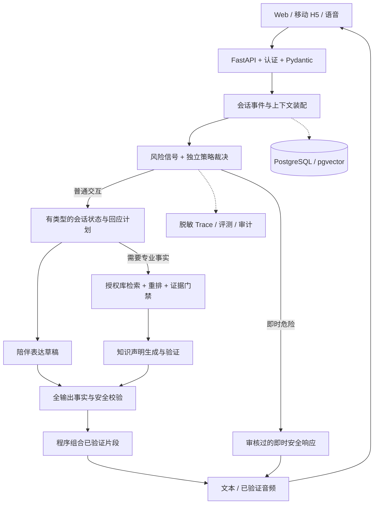

# 宝妈助手：现状对照、前沿目标与迭代方案 v5

> 2026-09-16。历史架构与验收方案，已由 [v6 产品方案](./融合陪伴与循证问答产品方案-v6.md)和 [v6 技术架构](./融合陪伴与循证问答技术架构-v6.md)更新。下文“当前现状”是 M0/M1 改造前的快照，不能用于描述当前代码；已完成工作见 [M0/M1 实施记录](./M0-M1-实施记录.md)。框架选择、实施顺序和性能目标冲突以 v6 为准。
>
> 目标是达到同类产品的先进工程与体验水平。不能仅凭架构图宣称 SOTA，必须通过版本化的中文母婴多轮评测、专业审核、延迟/成本实测和对照实验来证明。本文不承诺临床疗效或零风险。

## 1. 结论与路线

当前不是还缺几个情绪词，而是缺少可信的会话运行时。

目标：**Stateful Companion Engine + Evidence-Constrained Knowledge Engine + Independent Safety Policy**。

用户只面对一个自然、温和的助手。内部则分开管理：会话事实、暂时情绪假设、回应策略、专业知识授权、风险状态。普通回应不需要命中情绪白名单，专业事实不因“陪伴优先”而获得自由生成权限。

先做状态与评测，再做知识证据闭环，最后优化实时语音与模型训练。不先增加多 Agent、自主联网或无限长期记忆。

## 2. 历史现状：M0/M1 改造前

本节基于本次读取的 `app.py` 与已有前端实现，不把历史聊天中的“已完成”描述当成验证证据；没有重新探测当前服务进程的 API 配置。

| 维度 | 当前实现 | 与目标的差距 |
|---|---|---|
| 会话历史 | 前端保存数组，后端接收最近消息与 route | 刷新丢失、客户端可伪造，无服务端身份与并发版本 |
| 会话理解 | `classify_intent` 输出 emotion/need/strategy/knowledge_query | 截取 JSON、宽松修正字段，无强类型状态与计划版本 |
| 情绪延续 | 短语、第一人称正则、最近数条 route | 不能可靠处理话题切换、否定、结束和未解决需求 |
| 回复策略 | 将计划放入 `call_companion_llm` Prompt | 无建议接受/拒绝记录，无独立反重复评分 |
| 知识触发 | 模型意图与医疗关键词 OR | 漏判的专业请求可能进入无证据的陪伴生成 |
| 检索 | 中文字符/bigram、可选 embedding，max 分数与 0.24 阈值 | 无校准、BM25、重排、模型维度版本和人群过滤 |
| 知识回答 | 陪伴模型看证据后生成引用编号 | 有引用不等于每条结论被证据支持 |
| 无证据 | 已识别为知识请求时跳过生成 | 有价值的约束，但依赖知识识别，不是全面事实授权 |
| 输出安全 | 正则命中后 fallback，有证据时返回原始分块 | 未审核分块可能重新输出被拦内容；缺少全输出事实检查 |
| 危机判断 | 当前 query 词表优先，历史主要由 Prompt 处理 | 无主体、否定、时态、意图和多轮恶化建模 |
| 摄入 | Markdown 分块、注入行过滤、JSON 文件存储 | 无审核、许可审批、有效期、来源继承和回滚 |
| 身份说明 | 固定内容 | 子串可能误匹配；没有审批流程却使用“已审核”措辞 |
| 语音 | 浏览器识别、自动发送、speechSynthesis | 取消/最终识别竞态，播放状态时间估算，非实时语音运行时 |
| 配置 | 环境变量和网页进程内配置，异常返回 None | 重启配置丢失，真实生成与降级不可辨，无管理鉴权 |
| 测试 | 少量 mock 单测与手工请求 | 不能证明多轮陪伴质量、医学安全或真实语音稳定性 |

### 必须纠正的既有判断

- 当前是“尽力约束的知识增强”，不是已证明的严格事实闭域。
- 任意危险关键词不能等同于确定性临床危机；“我是不是产后抑郁”不自动等于即时危险。
- “帮我推荐怎么休息”不应因为“推荐”二字就被当成品牌咨询。
- 固定模板降级不能展示为正常模型成功；单测通过不能当成真实模型已验证。
- 15 条流程测试无法覆盖中文自然语言全集，也不能证明 99% 临床召回。

## 3. 前沿能力与官方实践对照

以下官方页面已在本次核查；它们证明方法或能力存在，不证明本项目已获得同等效果。历史研究、当前工程能力和实验方向明确分开。

| 来源 | 已核实内容 | 采用方式与限制 |
|---|---|---|
| [OpenAI Agents SDK Sessions](https://openai.github.io/openai-agents-python/sessions/) | 历史读写、清除、存储实现、上下文限制与压缩 | 借鉴 Session 协议；不重复维护两套历史 |
| [LangGraph Persistence](https://docs.langchain.com/oss/python/langgraph/persistence) | thread checkpoint 与跨线程 store 分离 | 目标使用持久状态图，业务 DB 是事实来源，checkpoint 负责执行恢复 |
| [Letta](https://github.com/letta-ai/letta) | 状态与记忆驱动 Agent；本次 README 指向 letta-ai/letta-code 为当前源码 | 借鉴记忆生命周期，不启用模型自主改写医学事实/用户档案 |
| [Anthropic Contextual Retrieval](https://www.anthropic.com/engineering/contextual-retrieval) | 2024 年发布的 chunk 上下文增强、BM25+dense、重排实验 | 属于成熟检索方法；其通用实验增益不能直接宣称为母婴场景增益 |
| [LiveKit Agents](https://github.com/livekit/agents) | STT/LLM/TTS 组合、WebRTC、语义轮次检测与测试 | 实时语音候选；框架 Apache-2.0，轮次模型许可另审 |
| [ESConv](https://github.com/thu-coai/Emotional-Support-Conversation) | ACL 2021 策略标注研究，后续补充失败样本 | 参考策略和负例，不是最新临床引擎；官方限学术研究，商用需另获许可 |
| [LoCoMo](https://github.com/snap-research/locomo) | ACL 2024 长时会话记忆评测，问答带来源消息 ID | 参考时间关系与记忆归因，不能替代陪伴和危机评测 |
| [HealthBench 参考实现](https://github.com/openai/simple-evals) | 医疗 rubric 与 meta-eval；README 声明不再更新新模型榜单 | 参考评分和裁判校准，不把旧榜单当当前模型排名 |

其他组件候选：[PydanticAI](https://github.com/pydantic/pydantic-ai)、[pgvector](https://github.com/pgvector/pgvector)、[FlagEmbedding](https://github.com/FlagOpen/FlagEmbedding)、[Ragas](https://github.com/vibrantlabsai/ragas)、[DeepEval](https://github.com/confident-ai/deepeval)。实现时核查并锁定版本，代码许可不自动覆盖权重、数据和托管服务。

### 三层先进性

1. **成熟工程底线**：类型契约、会话所有权、幂等、持久执行、混合检索、证据版本、取消传播、可观测性。
2. **先进目标能力**：来源可追溯的分层记忆、策略条件化陪伴、上下文增强检索、逐声明验证、风险自适应计算、语音打断。
3. **实验轨道**：偏好优化、规划器蒸馏、学习式检索校准、受约束原生 speech-to-speech。必须测赢基线且不损害安全才发布。

## 4. 选定的目标技术栈



主路径：FastAPI + Pydantic + LangGraph 有界状态图 + 异步 Provider Adapters + PostgreSQL/pgvector + 中文 BM25 索引 + OpenTelemetry。语音阶段增加 LiveKit/WebRTC，不让音频框架替代知识安全层。

LangGraph 是目标运行时，首个迁移步骤仍可用相同契约的 Python 工作流。PydanticAI、OpenAI Agents SDK 是替代方案，不同时负责主循环。PostgreSQL 默认全文检索不是 BM25，也不自带完备的中文分词，必须显式选择与测试。

首期部署为在线 API/对话 worker、离线摄入/评测 worker、PostgreSQL。不要为每个逻辑节点单独建微服务；音频容量增长后才独立扩容语音 worker。

## 5. Context Engine：记忆与连续性

上下文包 = 最近原文 + 有来源的摘要 + 未解决问题 + 已被拒绝的建议 + 用户确认偏好 + 未完成风险澄清。

- 记忆分为工作记忆、近期事件、确认偏好；专业知识是独立第四类，情绪记忆不能成为医疗证据。
- 状态采用增量 patch、schema 校验和 revision CAS，模型不能直接写数据库。
- 每条记忆有来源消息、时间、用途、有效期、是否确认和删除标记。
- 健康事实只能来自用户明确陈述；长期保存需授权。模型情绪解释是 hypothesis，不是诊断。
- “好的”按确认/接受/结束等会话动作解释，不再依靠情绪词表。
- 用户说“没有人能接手”后，记录建议不可行，不反复建议找人接手。
- 保留危机上下文，但不能因历史提过危机就永远重复急救话术；当前风险需重新评估。
- 摘要在空闲时压缩，不能删除用户纠正信息或重要未解决风险；设置记忆 token 预算。
- 用户可查看、纠正、删除记忆；删除覆盖源记录、摘要、向量索引和后续缓存。

## 6. Planner：先选策略，再生成语言

安全评估和普通会话理解可以并行，但内容发布必须等待安全裁决。高可信即时风险规则可以提前终止普通生成。

```json
{
  "dialogue_act": "ask_permission",
  "topic_hypothesis": "难以休息",
  "need_hypothesis": "validation",
  "evidence_message_ids": ["m17", "m19"],
  "strategy": "brief_acknowledgement",
  "question_budget": 0,
  "needs_knowledge": false,
  "knowledge_query": null,
  "allowed_tools": [],
  "response_budget": "short"
}
```

模型提供候选计划，`allowed_tools` 由代码根据权限产生；禁止模型自授权。知识查询改写不能添加疾病、月龄或用户未给出的条件。确认/身份问题走轻量路径，不要求每轮固定两次慢模型调用。

计划不保存隐藏思维链，只记录决策字段、来源和策略版本。输出模型可以复用同一厂商，但陪伴生成与知识声明生成必须是不同契约的调用。

## 7. Response Engine：一个角色，两类内容授权

- 陪伴负责自然交互，不强制每次安慰、提问或给建议；不凭空肯定“你一定是好妈妈”。
- 知识声明包含 text、evidence_ids、supporting_quote、适用范围；校验 ID、原文、支持关系、例外和安全边界。
- 最终由程序组合已验证片段，不让自由 Composer 再改写专业结论。
- **整个输出都要检查**：专业断言不能藏在陪伴段落，如“放心，这不是病”“闭眼睡孩子不会有事”。
- 对已有证据仍需检测越界推断；对无证据输出禁止医学结论，不只检查少量药名或数字。
- 校验失败最多一次受限修复，不通过则说明知识边界。不能把未审分块原样吐出绕过拦截。

完全生成式回答不能保证数学意义的零幻觉。更强控制模式采用“已审核知识卡原文选择”：模型选择卡片、程序验证条件并展示原文；仅非医学过渡句可自然生成。受约束改写模式经评测后逐步开放。

## 8. 前沿 RAG：先建立强基线，再叠加能力

当前少量 Markdown 应比较：

1. 全部有效知识放入长上下文并保留段落 ID，供应商支持时缓存稳定前缀。
2. 标题感知 BM25 + dense + reranker。
3. 上下文增强检索：标题、适用人群、时间、节路径加入索引文本。

长上下文不取消权限和引用校验；向量库不自动比小库全量上下文先进。通过召回、引用错误、延迟和 token 成本选择。

目标链路：来源审查 -> AST 分块 -> 原文/索引上下文双存储 -> 批量向量化 -> 权限/有效期/人群过滤 -> BM25+dense -> RRF -> reranker -> 足够/不足/冲突/条件缺失 -> 原子声明验证。

机器生成的 chunk 说明只能辅助召回，不能成为权威医学证据。允许最多一次受限重检索；不能放宽人群条件、取消门槛或联网补答。Embedding 模型、维度和切分变更必须构建新索引，影子评测后切换。

GraphRAG、多跳 Agent 只在跨文档关系题占比高、简单检索失败时实验，不作为当前默认底座。

## 9. 情绪陪伴模型优化

先建立中文母婴情景和偏好 rubric，再训练，不先凭感觉微调模型。

| 场景 | 优选 | 劣选 |
|---|---|---|
| 没有人能帮忙 | 承认现实限制、减少要求 | 重复找家人接手 |
| 好的 | 简短确认或允许结束 | 重启长篇共情 |
| 不是好妈妈 | 具体回应或温和澄清 | 无依据保证她一定优秀 |
| 婴儿症状 + 焦虑 | 情绪承接 + 证据/边界 | 安慰中夹带无证据医学判断 |

进入训练的条件是强通用模型 + 类型化计划 + 精简上下文仍存在可重复错误：

- SFT 学习经授权且专业审核的多轮风格与结构，不把实时医学知识写进权重。
- DPO/偏好优化针对重复、空泛安慰、越界建议；用户满意不是唯一奖励。
- 蒸馏将优质规划器迁移到小模型，只有安全和意图不退化才切换。
- 少量候选重排只用于复杂低风险轮，不在每轮多 Agent 辩论。
- 数据按完整会话和来源拆分，防止改写泄漏；真实健康对话不默认训练。

## 10. 实时语音路线

生产主路径选择流式 ASR -> 文本 Harness -> 已验证段落 -> TTS。这样可以在专业内容播出前校验，不仅事后转写审计。

LiveKit 或同类运行时负责 WebRTC、VAD、轮次检测和音频生命周期。用户发声时停止播放，取消旧 turn，丢弃迟到结果，并记录实际播出的片段，避免下一轮引用用户尚未听到的建议。

原生 speech-to-speech 属于实验轨道：如果无法在音频释放前确保知识约束，不用于含医疗事实的主服务。语气识别只能是可选弱信号，不诊断焦虑或抑郁。

初始工程 SLO（目标而非实测）：约定环境 20 个并发会话，文本陪伴首个已验证响应 P95 <= 3 秒，知识完整响应 P95 <= 8 秒，语音停说到首个已验证音频 P95 <= 2.5 秒，本地播放打断 P95 <= 300ms。先测真实模型与网络，再评审预算；达不到时减少非必要调用，不跳过安全验证。

## 11. 如何证明达到先进水平

### 对照与消融

| 版本 | 含义 |
|---|---|
| B0 | 冻结当前代码、Prompt、模型配置和知识库 |
| B1 | 强通用模型 + 同库长上下文 + 相同安全策略 |
| B2 | 常规 hybrid RAG + 单轮陪伴 Prompt |
| T1 | 服务端状态 + 策略规划 + 授权事实引擎 |
| T2 | T1 加一个实验组件：上下文增强/记忆检索/偏好模型 |

统一模型版本、预算、可见知识和测试集；随机打乱输出、盲化模型身份。逐项移除状态、重排、重复检查做消融，避免同时换五个组件却无法归因。

### 第一批资产

- 200 段中文母婴多轮情景，每段 6–12 轮，覆盖倾诉、确认、拒绝建议、纠正、依赖、知识混合与结束。
- 200 道知识题，覆盖可答/缺证据/冲突/过期/年龄不适用/需澄清，标注证据 ID 与禁止结论。
- 独立专业审核安全挑战集：显性/隐性风险、否定、历史、第三人称、注入。
- 50 组语音/客户端事件脚本：拒权、噪声、取消、打断、乱序、断网、恢复。

数量是首轮实验规模，不代表现实覆盖。高风险实验先离线/影子测试，不让脆弱用户承担未经验证的 A/B 风险。

### 发布指标

- 已有确定性失败模式回归全通过，模型生成和降级在日志/界面可辨。
- 陪伴盲评胜率 95% 置信区间下界高于 50%，同时安全、专业准确性和过度拒答不退化；未过不能宣称超过基线。
- 报告 claim 支持率、错误引用、适用条件遗漏和缺证据生成率，不能用总满意度掩盖医疗错误。
- 记忆测事实准确、纠正生效、来源归因、删除后不再召回，而非只测记住多少。
- 风险按类别报告召回、误报、样本数和置信区间；关键挑战集严重违规阻断发布。
- 每个真实模型版本至少重跑 3 次并报告波动；judge 与专业人工校准，分歧必须审查。

公开资料不能证明一个开源栈就是“最先进的宝妈引擎”。应交付领先能力覆盖与可复现证据；只在明确比较范围内测赢，才能作相应性能声明。

## 12. 可执行里程碑

按 2 名后端/AI、1 名前端、兼职专业审核支持估算；受数据授权、模型供应商和审核资源影响，时间不是承诺。

| 阶段 | 参考时间 | 交付 | 验收 |
|---|---|---|---|
| M0 基线 | 第 1 周 | 冻结 B0、失败集、降级日志、纠正未审核却宣称已审核 | 每个既有失败可重放；安全测试保留 |
| M1 会话 | 第 2–3 周 | FastAPI、类型契约、会话 DB、幂等、状态摘要、配置管理 | 刷新/并发/短回复不丢语境，删除有效 |
| M2 策略 | 第 3–5 周 | 拒绝建议记忆、反重复、话题切换、偏好 | 多轮盲评优于 B0，安全不退化 |
| M3 事实 | 第 4–7 周 | 审核快照、检索对照、claim 校验、程序组合 | 缺证据不补事实，引用和人群约束过关 |
| M4 语音 | 第 6–9 周 | 流式语音、取消传播、实际播放状态、设备恢复 | 端到端事件与约定 SLO 实测通过 |
| M5 试点 | 第 9–12 周 | 脱敏观测、灰度回滚、专家复核、可选蒸馏实验 | T1 对照评测和安全报告完成 |

可并行开发，但安全、隐私和专业审核不能排在上线之后。没有审核和真实人工接收能力时，仅作受限 Demo/内部试点，不承诺临床服务或真人接管。

每次发布锁定：代码提交、依赖、policy/prompt/schema、模型供应商及版本、知识快照、切分版本、embedding space、评测集与 judge 版本。功能开关控制新状态、检索、生成和语音；索引影子验证后切换，数据库迁移向后兼容，回滚不删除用户会话。

## 13. 最终决策

**现在做：** 服务端真实状态、类型化计划、陪伴与专业事实分离、全输出验证、可观测降级、多轮负例评测。

**暂不做：** 开放联网问诊、自主处方工具、默认永久画像、未授权训练、操纵留存、每轮多 Agent 辩论、播出后才审核的医疗语音。

前沿水准应体现为理解更连续、策略更合适、知识更可信、延迟更可控、风险更可测，而不是更像“疗愈大师”或使用更多框架。
