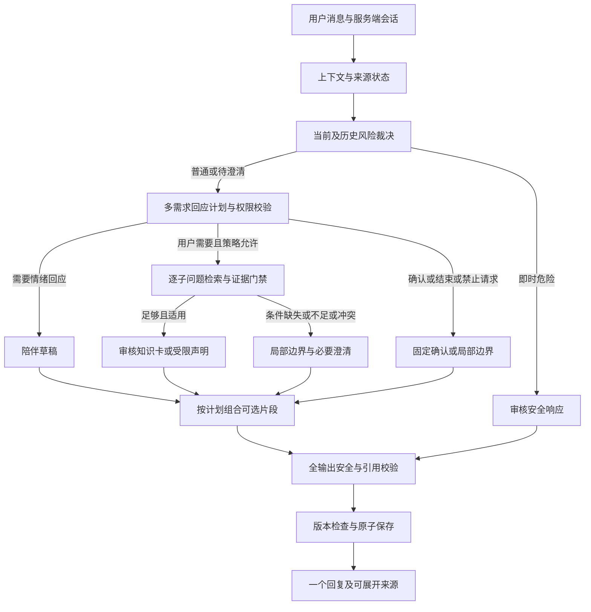

# 宝妈助手：融合陪伴与循证问答技术架构 v6

> 2026-09-16。当前目标架构，配套 [v6 产品方案](./融合陪伴与循证问答产品方案-v6.md)。
> 本轮仅修改文档。下述新模块、JSON 契约与门禁均待实现，不改变现有 API；现状基于提交 `4399d70`。

> 后续实施增量见 [F0/F1 第一批实施记录](./F0-F1-第一批实施记录.md)。本文的基线对照保留设计时快照；完整目标未随第一批代码一次性实现。

## 1. 决策与文档优先级

**一个对话角色，一个受控编排流程，多项用户需求，两类内容授权，独立安全裁决。**

v6 产品/技术文档是后续实施基准；v4/v5 保留设计过程和候选组件，不再是“必须照单实现”的依赖清单。已完成能力以代码和 [M0/M1 记录](./M0-M1-实施记录.md)为准。

| 决策 | v6 选择 |
|---|---|
| 如何融合 | 计划可同时请求陪伴与一个或多个知识回答；不使用互斥情绪/知识模式 |
| 首期部署 | 现有单进程服务与 SQLite 上逐步模块化；当前不整体重写、不直接公开部署 |
| 编排框架 | 显式有界 Python 流程；LangGraph 仅在持久任务、暂停恢复确有需求时评估，不是前置依赖 |
| Web/存储升级 | FastAPI/Pydantic、PostgreSQL 为后续服务化候选；多进程前必须替换进程内会话锁，不能只换 HTTP 框架 |
| 专业事实 | 首期采用审核知识卡选择及条件校验；有证据也不允许诊断、剂量和个体化治疗 |
| 生成调用 | 逻辑授权分离不等于每轮调用两个生成模型；知识卡由程序渲染，陪伴仅在必要时生成 |
| 平台接入 | AstrBot 先作为对照；Dify/RAGFlow 在知识运营或复杂文档需求出现时评估，不叠加部署多个主循环 |
| 外部信息 | 默认无自主联网补答；产品案例有搜索工具不构成本项目开放搜索的理由 |

## 2. 已实现与真实缺口

| 能力 | 已实现 | v6 尚缺 |
|---|---|---|
| 会话 | SQLite、24h 固定 TTL、幂等、revision、删除和刷新恢复 | 带来源的状态、建议拒绝记录、风险连续性；现有生成上下文最近 3 轮 |
| 计划 | `ConversationPlan` 校验两个可同时为真的布尔意图、need、strategy 等 | 子问题列表、会话动作、当前信息意愿、条件来源、计划版本 |
| 混合回答 | `app.py` 将计划与检索片段交给同一次陪伴生成 | 专业声明独立授权、部分可答、验证后组合 |
| 检索 | 字符/bigram 词法、可选 embedding、max 混合 | 审核快照、适用性过滤、可校准检索及失败标记 |
| 引用 | 前端展示证据列表，提示模型标编号 | 实际引用映射、原文/版本核验、陈述支持关系 |
| 输出安全 | 正则命中模型输出时立即固定回复，不再吐原始片段 | 生成未配置/失败等分支仍可能输出原始分块；所有出口统一校验尚未实现 |
| 运行状态 | `execution` 区分固定/模型/降级，已有 48 条测试记录 | 真实模型多轮融合评测、专业复核、分阶段延迟和成本测量 |

现有双意图布尔字段不是互斥分类；问题在于执行与验证契约不够细，不是从零新增第二条能力。48 条是上一轮运行记录，本轮文档变更没有重跑模型评测。

## 3. 单轮执行与模块边界



- 图中分支可同时执行，不是让用户选择模式；具体是否并行取决于依赖和超时预算。
- 专业输出等待证据门禁和安全裁决。即时安全文本采用预先审核版本及轻量确定性检查，不等待 LLM 裁判。
- 陪伴文本不能夹带专业结论；所有片段组合后再检查，避免拼接形成新的因果关系或个体建议。
- 不强制每次同时输出两种内容。没有情绪表达的直接问题可只输出知识；明确结束可只返回短确认。
- 生成/检索/验证失败进入同一个发布出口；验证服务不可用时，退到审核固定边界文本，不放行未验证草稿。

建议先抽出 `conversation_state`、`response_policy`、`knowledge_service`、`response_composer`、`response_validator` 五个职责；具体包名在实施时确定，不为每个节点建微服务。

## 4. 多需求计划契约

以下为目标示例，不是当前 `ConversationPlan.parse` 可接受的请求，也不用于存储隐藏思维链：

```json
{
  "schema_version": "fusion-plan-v1",
  "dialogue_act": "ask_and_share",
  "support": {"needed": true, "strategy": "acknowledge_specific_feeling"},
  "information_preference": "requested",
  "knowledge_requests": [
    {
      "id": "k1",
      "question": "了解混合喂养的一般信息",
      "source_message_ids": ["m17"],
      "conditions": []
    }
  ],
  "question_budget": 1,
  "response_length": "short"
}
```

- `information_preference` 为 `requested / deferred / unknown`：明确问题通常就是信息请求，不反复问许可；用户当前拒绝普通建议时不沿用上一轮计划。即时危险由独立策略处理，不能被 `deferred` 覆盖。
- `conditions` 仅接收带来源的用户明确条件；缺失不由模型补齐。查询改写不得添加疾病、年龄或用户未陈述的前提。
- 子问题 ID 仅在该轮有效；每条分别经过策略与证据校验。支持一个子问题，不代表支持整条消息或相邻陈述。
- 模型只提出计划。代码根据权限、风险、用户意愿及内容可用性授予工具权限；额外字段、无效枚举、越界来源拒绝。
- 计划失败时不把“意图未知”当作“没有知识需求”。只能生成受限非专业回应/必要澄清，不能依赖关键词未命中来授权专业事实。

## 5. 会话状态与更新

状态保存：当前主题假设、用户表达的现实限制、未解决问题、已拒绝建议、信息偏好、最近回应策略和待澄清风险。每条状态有来源消息 ID、更新时间、是否为假设、失效条件。

- 用户明确陈述与模型解释分开；“用户说很累”不等于“用户患有抑郁”。记忆不进入专业知识索引。
- 建议拒绝按主题和范围记录；“先别讲喂养方法”不应永久禁止所有知识回答，用户后续明确请求可更新偏好。
- 风险状态不能仅因“好的”而清空，也不能因一次历史表达永久触发急救；保存依据并按当前语境重新评估。
- 服务端验证状态 patch，并与本轮消息/响应通过 revision 检查原子提交；重试不重复生成、重复写记忆。删除与过期使旧 patch 失效。
- 默认状态不跨会话，随现有 TTL 和删除清除；摘要继承来源和失效规则。长期记忆另立授权与删除策略，不随本次上线。
- 当前历史回调仅提供 role/content/route；未来来源 ID 必须由服务端生成并扩展内部接口，不能让模型编造或信任客户端提交的来源。

## 6. 知识授权与局部失败

### 知识发布

导入草稿 -> 解析并保留标题/条件/例外 -> 来源和许可检查 -> 专业审核 -> 固定版本与索引 -> 回归测试 -> 发布快照。审核人员、时间、适用人群、地区、有效期可追溯，支持撤回。

知识卡包含：`card_id / document_version / source_url / source_offsets / reviewed_text / applicability / review_status / valid_until`。审核文本不能只留下结论而丢掉警告；用户上传和网络公开资料不自动获得发布权限。

### 每个子问题的结果

| `knowledge_status`（目标内部字段） | 专业内容策略 | 对话可继续做什么 |
|---|---|---|
| `supported` | 只发布适用、有效且通过校验的内容 | 自然连接到当前问题，不额外推导个体结论 |
| `missing_conditions` | 暂缓依赖缺失条件的结论 | 在总问题预算内澄清；其余独立可答部分可回答 |
| `insufficient_evidence` | 不补猜、不原样吐未审分块 | 说明局部边界，继续倾听或整理咨询问题 |
| `conflicting_evidence` | 不自行挑选更能安慰用户的结论 | 说明资料未能给出一致依据，建议专业确认 |
| `prohibited` | 即使有来源也不回答诊断/剂量等个体决策 | 不延误就医的前提下回应其他安全需求 |
| `not_requested` | 当前不展开专业内容 | 倾听、确认、结束；不是检索故障 |

上游错误单独进入 `execution`，不得伪装成知识库确实没有内容。部分可答也不能绕过整体风险裁决，例如不能在明确急症下继续长篇科普。

### 两档生成策略

1. **首期严格卡片模式**：选择审核知识卡，程序检查条件和版本并保留原文/必要警告，减少专业自由生成。陪伴与连接句可自然生成，但不得新增专业断言；纯知识回答不必调用陪伴模型。
2. **后续受限改写模式**：声明带 `text / evidence_ids / supporting_quote / applicability`，与陪伴生成采用不同契约。验证引用所属快照、原文对应和支持关系，最多一次受限修复；失败后局部降级。只有对照评测通过才开放。

不再用自由 Composer 模型重写已验证事实。程序按计划排列片段，去重后全文复检；片段数量和顺序可变，不能退化成固定四步模板。引用格式校验与语义支持校验分开报告，LLM/NLI 检查只能提供辅助信号。

## 7. 检索与开源选型实验

| 对照 | 要回答的问题 | 控制变量 |
|---|---|---|
| 当前 demo / AstrBot 配置 | 通用陪伴平台能否减少我们需要自建的部分 | 相同模型、审核语料、场景、预算；记录人设、插件、上下文与安全策略差异 |
| 小库全量有效内容 / BM25 / hybrid | 现阶段是否确有向量和重排收益 | 固定知识快照、题目与答案证据，分别测召回、支持率、错误引用、延迟和成本 |
| 有无会话状态 | 是否改善连续陪伴而不引入错误记忆 | 固定其余组件，重点看建议拒绝、纠正和话题切换 |

AstrBot 是对照候选，不预先指定为替代平台。若不能强制使用审核内容和统一发布校验，仅借鉴组件或保留离线对照用途。适配器统一返回带版本的证据，不能直接透传第三方生成回答绕过本地校验。

Dify 可在非开发人员需要持续调试知识/工作流时评估；RAGFlow 可在复杂 PDF/表格摄入成为主要成本时评估。Onyx 的引用映射、Open WebUI 的可纠正记忆作为局部参考。重排不等于校验事实，融合权重必须用本地样本选择。

选型锁定仓库提交、插件、模型和配置，审核代码/数据/权重许可证；不沿用营销指标作为验收结果。尤其不能把 MyLÚA 的早期风险模型指标当作我们的目标或背书。

## 8. API、故障与隐私

当前保留 `/api/session`、`/api/ask`、`/api/session/clear` 和 cookie/request_id/revision 契约。未来通过有版本的响应增加子问题状态、片段和来源；不在本轮文档更新中改变接口。

- 每条专业片段关联请求、知识快照和实际使用的证据；检索候选与最终引用分开，不将 top-k 全部标为已引用。
- 生成失败、无 API 配置、输出拦截、检索异常、版本冲突、删除/过期分别有可测试行为。固定边界文本优先于任何未验证内容。
- 初期沿用单会话串行；跨进程或后台任务须增加共享并发控制和取消语义。旧请求不能覆盖新状态或恢复已删除内容。
- 首期不流式释放未经校验的专业句子，也不先朗读再审核。语音仅消费已发布文本，当前浏览器转写确认规则保留。
- Trace 默认仅必要元数据：请求标识、策略/模型/知识版本、证据 ID、各阶段状态和耗时；标识仍属敏感数据，应限权和限期。
- 不额外复制完整健康对话到日志或评测平台。反馈与原文的关联需权限与保留策略；删除覆盖会话、状态及本地关联缓存，备份/供应商保留需另行说明。
- 非专业支持练习若引入，作为独立受控内容目录，有许可和适用限制，不能因名为“陪伴”而免审核。

## 9. 分阶段交付与验收

采用 F 阶段表示融合交付，避免把已完成的 M0/M1 第一批等同于 v5 全部里程碑。以下均待实现，不承诺固定工期。

| 阶段 | 交付 | 通过条件 |
|---|---|---|
| F0 基线与出口 | 冻结 `4399d70` 行为、融合场景、负例；统一所有输出/降级路径 | 含生成失败和无配置的测试均不吐未审核内容；既有会话幂等/删除测试无回归 |
| F1 最小融合闭环 | 多需求计划、来源状态、拒绝建议、审核知识卡、局部边界、引用映射 | 同一多轮场景覆盖可答、缺证据、混合需求、拒绝建议和纠正；情绪与知识共同验收 |
| F2 对照与优化 | AstrBot 对照、检索实验、可选受限改写、反馈与耗时记录 | 固定条件下报告融合质量、支持率、风险/误拒与成本；未优于基线的复杂组件不引入 |
| F3 试点门禁 | 专业复核、账号/访问控制、HTTPS、限流、数据治理、部署与回滚 | 明确责任人、审核来源及风险资源；未经门禁只限内部 Demo，不宣称临床服务 |

评测包含确定性契约测试、mock 故障测试、真实模型多轮离线盲评和专业审查。混合轮分别评分情绪回应、信息满足、证据支持、条件保留与自然程度；不合成一个能掩盖安全问题的总分。

对关键案例重复运行并报告波动、样本数、失败分布；关键安全违规阻断发布。起步场景集见产品文档，不以样本内零违规宣称临床零风险。性能先测现状再定 SLO，不继承 v5 尚未实测的延迟数字为承诺。

## 10. 本次架构调整的边界

本次不新增账号、模型、数据库或 Agent，不更改 API，不部署 AstrBot，也不将任何产品资料导入母婴知识库。下一步是 F0/F1 的受限实现与对照验证，而不是先更换所有基础设施。
